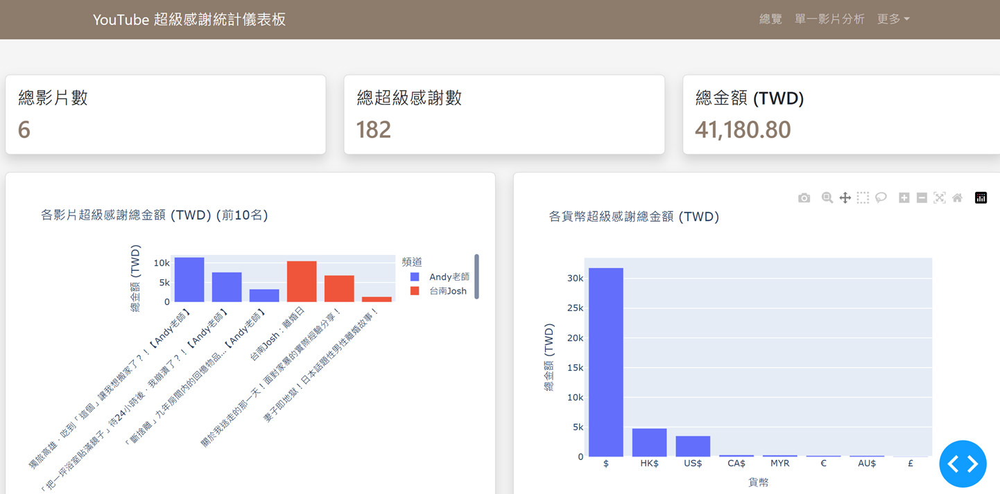
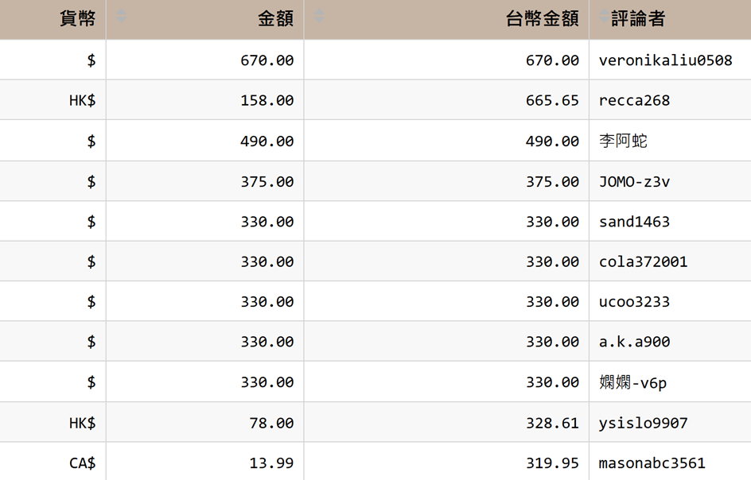

# YouTube 超級感謝抓取工具

這是一個用於抓取和分析YouTube影片超級感謝(Super Thanks)的工具。它能夠爬取YouTube影片的超級感謝資料，並提供統計分析和資料視覺化功能。

## 功能特點

- 抓取YouTube影片中的超級感謝資料
- 解析不同貨幣的超級感謝金額
- 統計分析超級感謝數量和金額
- 資料庫儲存和查詢功能
- 網頁展示分析結果

## Result
Some example pages : 





## 檔案結構

```
youtube_super_thanks/
│
├── main.py                
├── config.py             
├── dashboard.py             # 主要網頁儀表板
├── single_video_analysis.py # 單一影片分析頁面
├── requirements.txt        
├── README.md               
├── assets/                 
│   └── style.css          
├── database/
│   ├── __init__.py
│   ├── db_init.py           # 資料庫初始化
│   ├── db_queries.py        # 資料庫查詢
│   └── models.py            # 資料庫模型定義
├── scraper/
│   ├── __init__.py
│   ├── browser.py           # 瀏覽器相關功能
│   ├── parser.py            # 資料解析功能
│   └── scraper.py           # 主要爬蟲邏輯
└── utils/
    ├── __init__.py
    └── helpers.py           # 輔助功能
```

## 安裝與設置

```bash
pip install -r requirements.txt
```

## 使用方法

### 1. 爬取影片下面留言的超級感謝金額

```bash
python main.py
```

按照提示選擇操作並輸入YouTube影片URL或ID。

### 2. 啟動網頁

```bash
python dashboard.py
```

打開瀏覽器 http://127.0.0.1:8050/ 查看分析結果。

### 3. 單一影片分析

```bash
python single_video_analysis.py
```

專注於分析單一影片的超級感謝資料。

## 儀表板功能

- **總覽** - 顯示整體統計數據和分析圖表
- **單一影片分析** - 查看特定影片的超級感謝詳情

## Notice

- 確保你的系統已安裝與您Chrome瀏覽器版本相匹配的ChromeDriver
- 爬取速度受網絡和目標網站響應速度影響